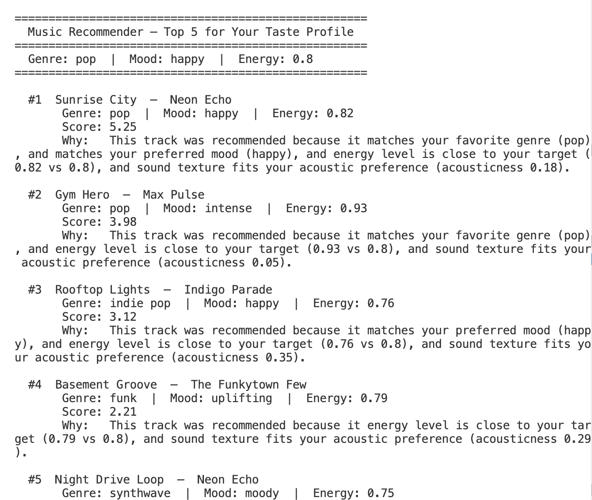

# 🎵 Music Recommender Simulation

## Project Summary

In this project you will build and explain a small music recommender system.

Your goal is to:

- Represent songs and a user "taste profile" as data
- Design a scoring rule that turns that data into recommendations
- Evaluate what your system gets right and wrong
- Reflect on how this mirrors real world AI recommenders

This simulation builds a content-based music recommender that scores songs by comparing their audio attributes against a user's stated taste profile. Unlike real-world platforms such as Spotify or YouTube, which blend collaborative filtering (learning from millions of listeners' behavior — streams, skips, playlist adds) with audio feature analysis, this version prioritizes transparency: every recommendation can be traced back to specific feature matches and a weighted score. The system will prioritize genre and mood alignment as hard-preference signals, then refine rankings using continuous proximity on energy and acousticness.

---

## How The System Works

Real-world recommenders like Spotify combine two strategies: **collaborative filtering** (if many listeners who love Song A also love Song B, recommend B to new fans of A) and **content-based filtering** (match a song's audio features directly to a user's stated or inferred taste profile). Collaborative filtering is powerful but requires massive behavioral data and fails for new songs with no listeners. Content-based filtering works immediately from audio attributes alone and produces explainable results. This simulation uses the content-based approach — scoring every song against a user profile and returning the closest matches — because transparency and simplicity matter more here than raw accuracy.

### Algorithm Recipe

For each song in `songs.csv`, the system computes a score by applying the following rules:

- Start with `score = 0`
- `+2.0` points if the song's `genre` matches the user's `favorite_genre`
- `+1.0` point if the song's `mood` matches the user's `favorite_mood`
- Add an energy similarity score based on how close `song.energy` is to `target_energy`
- Add an acousticness score to reward songs that match the user's acoustic preference

A practical scoring formula is:

```
score = 2.0 * genre_match
      + 1.0 * mood_match
      + 1.5 * max(0, 1 - abs(song.energy - user.target_energy))
      + 0.8 * acousticness_similarity
```

Where:
- `genre_match` is `1` if the genre matches, otherwise `0`
- `mood_match` is `1` if the mood matches, otherwise `0`
- `acousticness_similarity` is a value between `0` and `1` that rewards a closer acousticness match

### What gets scored

| Feature | Type | Role in scoring |
|---|---|---|
| `genre` | Categorical | Primary signal — highest weight |
| `mood` | Categorical | Secondary signal — gives emotional context |
| `energy` | Float 0–1 | Continuous similarity — refines intensity match |
| `acousticness` | Float 0–1 | Texture preference — supports mellow vs. electronic |
| `title`, `artist` | String | Display only, not used in scoring |

### Output

After scoring every song, the system sorts songs by total score in descending order and returns the top K recommendations. This creates a ranked list where the best matches to the user's taste profile appear first.

### Potential bias

This system might over-prioritize genre, ignoring great songs that match the user's mood, energy, or acoustic preference. Because categorical genre and mood matches are treated as strong binary signals, the recommender can miss nuance and under-represent songs that are a good fit in other ways.

### `UserProfile` Fields

| Field | Type | What it represents |
|---|---|---|
| `favorite_genre` | String | The genre the user most wants to hear |
| `favorite_mood` | String | The emotional context the user is looking for |
| `target_energy` | Float 0–1 | How intense or calm the user wants the music |
| `likes_acoustic` | Bool | Whether the user prefers organic/acoustic over produced/electronic sound |

### Sample Output

Running `python -m src.main` with the default pop/happy/energy-0.8 profile produces:

```
====================================================
  Music Recommender — Top 5 for Your Taste Profile
====================================================
  Genre: pop  |  Mood: happy  |  Energy: 0.8
====================================================

  #1  Sunrise City  —  Neon Echo
       Genre: pop  |  Mood: happy  |  Energy: 0.82
       Score: 5.25
       Why:   This track was recommended because it matches your favorite genre (pop), and matches your preferred mood (happy), and energy level is close to your target (0.82 vs 0.8), and sound texture fits your acoustic preference (acousticness 0.18).

  #2  Gym Hero  —  Max Pulse
       Genre: pop  |  Mood: intense  |  Energy: 0.93
       Score: 3.98
       Why:   This track was recommended because it matches your favorite genre (pop), and energy level is close to your target (0.93 vs 0.8), and sound texture fits your acoustic preference (acousticness 0.05).

  #3  Rooftop Lights  —  Indigo Parade
       Genre: indie pop  |  Mood: happy  |  Energy: 0.76
       Score: 3.12
       Why:   This track was recommended because it matches your preferred mood (happy), and energy level is close to your target (0.76 vs 0.8), and sound texture fits your acoustic preference (acousticness 0.35).

  #4  Basement Groove  —  The Funkytown Few
       Genre: funk  |  Mood: uplifting  |  Energy: 0.79
       Score: 2.21
       Why:   This track was recommended because it energy level is close to your target (0.79 vs 0.8), and sound texture fits your acoustic preference (acousticness 0.29).

  #5  Night Drive Loop  —  Neon Echo
       Genre: synthwave  |  Mood: moody  |  Energy: 0.75
       Score: 2.21
       Why:   This track was recommended because it energy level is close to your target (0.75 vs 0.8), and sound texture fits your acoustic preference (acousticness 0.22).
```



**Why these results make sense:**
- **#1 Sunrise City** hits all four features (genre + mood + energy + acousticness) → max score of 5.25
- **#2 Gym Hero** shares the genre gate but misses on mood (intense vs happy) — still ranks high because energy and acousticness are strong matches
- **#3 Rooftop Lights** compensates for a genre near-miss (indie pop ≠ pop) with a mood match and close energy
- **#4 / #5** score identically (2.21) — neither matches genre or mood, but both sit close to the target energy and low-acousticness preference

---

## Getting Started

### Setup

1. Create a virtual environment (optional but recommended):

   ```bash
   python -m venv .venv
   source .venv/bin/activate      # Mac or Linux
   .venv\Scripts\activate       # Windows
   ```

2. Install dependencies:

   ```bash
   pip install -r requirements.txt
   ```

3. Run the app:

   ```bash
   python -m src.main
   ```

### Running Tests

Run the starter tests with:

```bash
pytest
```

You can add more tests in `tests/test_recommender.py`.

---

## Experiments You Tried

- Tested the default profiles in `src/main.py` for high-energy pop, chill lofi, and deep intense rock.
- Checked whether the top 5 recommendations matched the requested genre, mood, and energy levels.
- Verified that songs with matching genre and mood were ranked higher than songs that only matched energy.
- Observed that the recommender still returned high-energy rock tracks for users who wanted sad or romantic moods when energy and genre were strong.

---

## Limitations and Risks

- The catalog is very small (18 songs), so the system cannot represent many music tastes.
- It does not use tempo, valence, danceability, artist, or lyrical meaning, which limits its emotional accuracy.
- It can over-favor genre and energy, causing the model to ignore mood or subtle style preferences.
- Rare or mixed preferences may be underrepresented, especially if the dataset has more chill and lofi examples.

---

## Reflection

This project showed me how a simple scoring system can feel like a recommendation engine when the input features are clear. I learned that matching genre, mood, energy, and acousticness can produce useful top songs, but the model still misses nuance when it treats genre and energy as the strongest signals.

I used AI tools as a writing and framing helper, especially to summarize the system and phrase the model card clearly. I still needed to double-check the actual code and dataset counts myself so the final description matched how the recommender really works.

I was surprised that the system could feel plausible with just four features and a small catalog, but also that it can easily push users toward the same familiar sounds when the data is limited. If I kept developing it, I would add more songs, more audio features like tempo and valence, and make the scoring less binary so mood and texture matter more.

---

## 7. `model_card_template.md`

Combines reflection and model card framing from the Module 3 guidance. :contentReference[oaicite:2]{index=2}  

```markdown
# 🎧 Model Card - Music Recommender Simulation

## 1. Model Name

Give your recommender a name, for example:

> VibeFinder 1.0

---

## 2. Intended Use

- What is this system trying to do
- Who is it for

Example:

> This model suggests 3 to 5 songs from a small catalog based on a user's preferred genre, mood, and energy level. It is for classroom exploration only, not for real users.

---

## 3. How It Works (Short Explanation)

Describe your scoring logic in plain language.

- What features of each song does it consider
- What information about the user does it use
- How does it turn those into a number

Try to avoid code in this section, treat it like an explanation to a non programmer.

---

## 4. Data

Describe your dataset.

- How many songs are in `data/songs.csv`
- Did you add or remove any songs
- What kinds of genres or moods are represented
- Whose taste does this data mostly reflect

---

## 5. Strengths

Where does your recommender work well

You can think about:
- Situations where the top results "felt right"
- Particular user profiles it served well
- Simplicity or transparency benefits

---

## 6. Limitations and Bias

Where does your recommender struggle

Some prompts:
- Does it ignore some genres or moods
- Does it treat all users as if they have the same taste shape
- Is it biased toward high energy or one genre by default
- How could this be unfair if used in a real product

---

## 7. Evaluation

How did you check your system

Examples:
- You tried multiple user profiles and wrote down whether the results matched your expectations
- You compared your simulation to what a real app like Spotify or YouTube tends to recommend
- You wrote tests for your scoring logic

You do not need a numeric metric, but if you used one, explain what it measures.

---

## 8. Future Work

If you had more time, how would you improve this recommender

Examples:

- Add support for multiple users and "group vibe" recommendations
- Balance diversity of songs instead of always picking the closest match
- Use more features, like tempo ranges or lyric themes

---

## 9. Personal Reflection

A few sentences about what you learned:

- What surprised you about how your system behaved
- How did building this change how you think about real music recommenders
- Where do you think human judgment still matters, even if the model seems "smart"

